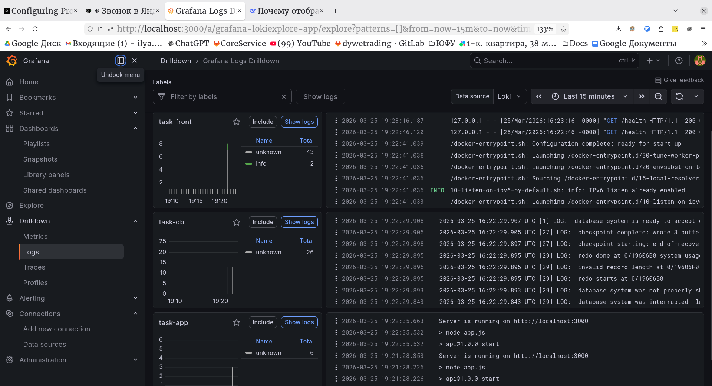
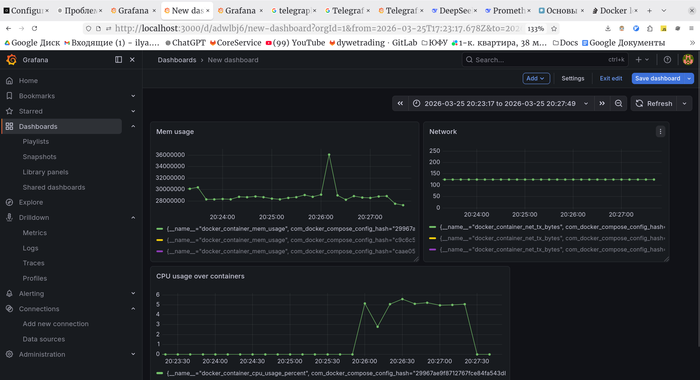

# Мониторинг
Телега собирает метрики по всем контейнерам приложения, закидывает в Prometheus. Alloy собирает логи, кидает их в Loki.


```
Graphana => Prometheus + Telegraph
        => Loki + Alloy
```

Loki и Prometheus подсасываются grapana'ой.

Логи скарпятся через alloy, передаются в Loki.



Настроил простенький dashboard в graphna.




## Запуск 

К сожалению, контейнер `telegraph` работает не от рута, поэтому нужно создать группу для `docker` сокета и пробросить ее в compose
```bash
groupadd docker
chown root:docker /var/run/docker.sock
chmod 770 /var/run/docker.sock

export DOCKER_GID=$(stat -c '%g' /var/run/docker.sock) # Или прописать в .env
docker compose up

```

